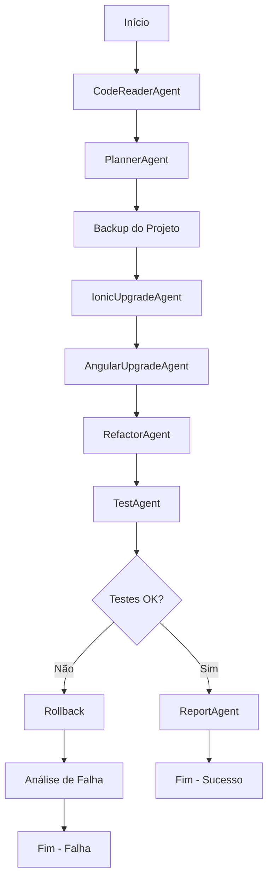

# Sistema de Upgrade Ionic/Angular - MetaGPT

## 🚀 Visão Geral

Este é um sistema multiagente inteligente desenvolvido com MetaGPT para automatizar o upgrade de projetos empresariais Ionic/Angular de complexidade média (50+ componentes). O sistema utiliza agentes colaborativos especializados para migrar projetos do Angular 12 e Ionic 5 para as versões mais recentes, mantendo a integridade do código e minimizando intervenções manuais.

## 🎯 Objetivos

- **Automatização Completa**: Upgrade automatizado com mínima intervenção manual
- **Segurança Máxima**: Zero tolerância para perda de código
- **Reversibilidade**: Todas as ações são reversíveis com rollback automático
- **Observabilidade**: Logging completo e relatórios detalhados
- **Escalabilidade**: Suporte a projetos com 50+ componentes
- **Integridade**: Manutenção da arquitetura original do projeto

## 🏗️ Arquitetura do Sistema

### Agentes Especializados

1. **CodeReaderAgent** 📖
   - Análise detalhada do projeto
   - Identificação de componentes e dependências
   - Mapeamento da estrutura do código

2. **PlannerAgent** 📋
   - Criação de estratégia de upgrade
   - Análise de breaking changes
   - Planejamento de fases incrementais

3. **IonicUpgradeAgent** 📱
   - Atualização de dependências Ionic
   - Migração de componentes Ionic
   - Resolução de incompatibilidades

4. **AngularUpgradeAgent** 🅰️
   - Migração de versões Angular
   - Atualização de sintaxe e APIs
   - Correção de breaking changes

5. **RefactorAgent** 🔧
   - Refatoração de código legado
   - Otimização de performance
   - Modernização de padrões

6. **TestAgent** 🧪
   - Validação automatizada
   - Execução de testes unitários e E2E
   - Verificação de integridade

7. **ReportAgent** 📊
   - Geração de relatórios detalhados
   - Documentação de transformações
   - Métricas de performance

### Fluxo de Execução



## 📋 Pré-requisitos

### Sistema
- **Node.js**: 18.x ou superior
- **npm**: 9.x ou superior
- **Python**: 3.8+ (para MetaGPT)
- **Espaço em disco**: Mínimo 10GB livres
- **Memória RAM**: Mínimo 8GB

### Ferramentas
- **Angular CLI**: Versão mais recente
- **Ionic CLI**: 7.x ou superior
- **Git**: Para controle de versão
- **MetaGPT**: Framework de agentes

### Dependências Python
```bash
pip install metagpt
pip install pyyaml
pip install aiofiles
pip install asyncio
```

## 🚀 Instalação

1. **Clone o repositório**:
```bash
git clone <repository-url>
cd ionic-angular-upgrade-system
```

2. **Instale as dependências Python**:
```bash
pip install -r requirements.txt
```

3. **Configure o ambiente**:
```bash
cp upgrade_config.yaml.example upgrade_config.yaml
# Edite o arquivo de configuração conforme necessário
```

4. **Valide a instalação**:
```bash
python example_usage.py --validate
```

## ⚙️ Configuração

### Arquivo de Configuração (upgrade_config.yaml)

O sistema utiliza um arquivo YAML para configuração detalhada:

```yaml
project:
  name: "Seu Projeto"
  path: "./caminho-do-projeto"
  backup_path: "./backups"

versions:
  current:
    angular: "12.2.0"
    ionic: "5.9.0"
  target:
    angular: "18.0.0"
    ionic: "8.0.0"

upgrade_settings:
  migration_strategy: "incremental"  # ou "direct"
  safety:
    create_backup: true
    rollback_enabled: true
    validation_required: true
```

### Configurações Principais

- **migration_strategy**: `incremental` (recomendado) ou `direct`
- **safety.create_backup**: Sempre `true` para projetos empresariais
- **safety.rollback_enabled**: Habilita rollback automático
- **validation_required**: Executa validação completa

## 🎮 Uso

### Execução Básica

```bash
python example_usage.py
```

### Execução com Configuração Customizada

```python
from ionic_angular_upgrade_system import IonicAngularUpgradeSystem

# Configurar sistema
system = IonicAngularUpgradeSystem(
    project_path="/caminho/do/projeto",
    config_path="minha_config.yaml"
)

# Executar upgrade
report = await system.execute_upgrade()

# Verificar resultado
if report.success:
    print("✅ Upgrade concluído com sucesso!")
else:
    print("❌ Upgrade falhou. Verificar logs.")
```

### Execução Passo a Passo

```python
# 1. Análise do projeto
analysis = await system.analyze_project()

# 2. Criação do plano
plan = await system.create_upgrade_plan(analysis)

# 3. Execução do upgrade
results = await system.execute_upgrade_plan(plan)

# 4. Validação
validation = await system.validate_upgrade(results)

# 5. Relatório
report = await system.generate_report(validation)
```

## 📊 Monitoramento e Logs

### Estrutura de Logs

```
logs/
├── upgrade_execution.log      # Log principal
├── agents/
│   ├── code_reader.log        # Logs do CodeReaderAgent
│   ├── planner.log            # Logs do PlannerAgent
│   ├── ionic_upgrade.log      # Logs do IonicUpgradeAgent
│   ├── angular_upgrade.log    # Logs do AngularUpgradeAgent
│   ├── refactor.log           # Logs do RefactorAgent
│   ├── test.log               # Logs do TestAgent
│   └── report.log             # Logs do ReportAgent
└── errors/
    └── error_details.log      # Logs de erro detalhados
```

### Níveis de Log

- **DEBUG**: Informações detalhadas para desenvolvimento
- **INFO**: Informações gerais de execução
- **WARNING**: Avisos que não impedem a execução
- **ERROR**: Erros que podem causar falhas
- **CRITICAL**: Erros críticos que param a execução

## 📈 Relatórios

### Tipos de Relatório

1. **Relatório Técnico** (JSON)
   - Dados estruturados completos
   - Métricas detalhadas
   - Logs de transformação

2. **Relatório Visual** (HTML)
   - Interface web interativa
   - Gráficos e métricas
   - Navegação por componentes

3. **Resumo Executivo** (Markdown/PDF)
   - Visão de alto nível
   - Impacto no negócio
   - Recomendações

### Estrutura do Relatório

```json
{
  "project_name": "Nome do Projeto",
  "success": true,
  "duration_minutes": 45.5,
  "timestamp": "2024-01-15T10:30:00Z",
  "summary": "Resumo executivo...",
  "components_processed": [
    {
      "component_name": "HomeComponent",
      "success": true,
      "changes_made": "Atualizado para Angular 18",
      "issues_found": [],
      "performance_impact": "Positivo"
    }
  ],
  "recommendations": [
    "Executar testes de regressão",
    "Monitorar performance em produção"
  ],
  "next_steps": [
    "Deploy em ambiente de staging",
    "Treinamento da equipe"
  ]
}
```

## 🔧 Troubleshooting

### Problemas Comuns

#### 1. Falha na Análise do Projeto
```bash
# Verificar estrutura do projeto
ls -la projeto/
# Deve conter: package.json, angular.json, ionic.config.json
```

#### 2. Erro de Dependências
```bash
# Limpar cache npm
npm cache clean --force
# Reinstalar dependências
rm -rf node_modules package-lock.json
npm install
```

#### 3. Falha nos Testes
```bash
# Executar testes manualmente
ng test --watch=false
ng e2e
```

#### 4. Problemas de Memória
```bash
# Aumentar limite de memória Node.js
export NODE_OPTIONS="--max-old-space-size=8192"
```

### Rollback Manual

Se o rollback automático falhar:

```bash
# 1. Parar todos os processos
pkill -f "ng serve"
pkill -f "ionic serve"

# 2. Restaurar backup
cp -r backups/backup_YYYYMMDD_HHMMSS/* projeto/

# 3. Reinstalar dependências originais
cd projeto
npm install

# 4. Verificar funcionamento
ng build
ionic build
```

## 🔒 Segurança

### Práticas de Segurança

1. **Backup Obrigatório**: Sempre criado antes do upgrade
2. **Validação de Integridade**: Verificação de checksums
3. **Rollback Automático**: Em caso de falha crítica
4. **Logs Auditáveis**: Rastreabilidade completa
5. **Isolamento**: Execução em ambiente controlado

### Verificações de Segurança

- Audit de dependências (`npm audit`)
- Verificação de vulnerabilidades
- Validação de assinaturas de pacotes
- Análise de código estático

## 📚 Exemplos

### Exemplo 1: Projeto Simples

```python
# Configuração mínima
config = {
    "project": {
        "path": "./meu-projeto"
    },
    "versions": {
        "current": {"angular": "12.0.0", "ionic": "5.0.0"},
        "target": {"angular": "18.0.0", "ionic": "8.0.0"}
    }
}

# Execução
system = IonicAngularUpgradeSystem(config=config)
report = await system.execute_upgrade()
```

### Exemplo 2: Projeto Empresarial

```python
# Configuração completa
config = load_config("enterprise_config.yaml")

# Sistema com observabilidade
system = IonicAngularUpgradeSystem(
    project_path="/projetos/enterprise-app",
    config=config,
    enable_monitoring=True,
    log_level="DEBUG"
)

# Execução com validação rigorosa
report = await system.execute_upgrade(
    validate_each_step=True,
    create_checkpoints=True,
    enable_rollback=True
)
```

### Exemplo 3: Upgrade Incremental

```python
# Configuração para upgrade incremental
phases = [
    {"from": "12", "to": "13"},
    {"from": "13", "to": "14"},
    {"from": "14", "to": "15"},
    {"from": "15", "to": "16"},
    {"from": "16", "to": "17"},
    {"from": "17", "to": "18"}
]

# Execução fase por fase
for phase in phases:
    print(f"Executando fase {phase['from']} → {phase['to']}")
    result = await system.execute_phase(phase)
    if not result.success:
        print(f"Falha na fase {phase}. Parando upgrade.")
        break
```

## 🤝 Contribuição

### Como Contribuir

1. **Fork** o repositório
2. **Crie** uma branch para sua feature (`git checkout -b feature/nova-feature`)
3. **Commit** suas mudanças (`git commit -am 'Adiciona nova feature'`)
4. **Push** para a branch (`git push origin feature/nova-feature`)
5. **Abra** um Pull Request

### Padrões de Código

- **Python**: PEP 8
- **TypeScript**: Angular Style Guide
- **Documentação**: Markdown com exemplos
- **Testes**: Cobertura mínima de 80%

### Estrutura de Commits

```
type(scope): description

[optional body]

[optional footer]
```

Tipos:
- `feat`: Nova funcionalidade
- `fix`: Correção de bug
- `docs`: Documentação
- `style`: Formatação
- `refactor`: Refatoração
- `test`: Testes
- `chore`: Manutenção

## 📄 Licença

Este projeto está licenciado sob a Licença MIT - veja o arquivo [LICENSE](LICENSE) para detalhes.

## 🆘 Suporte

### Canais de Suporte

- **Issues**: Para bugs e solicitações de features
- **Discussions**: Para dúvidas e discussões
- **Wiki**: Para documentação adicional
- **Email**: suporte@empresa.com

### FAQ

**Q: O sistema funciona com projetos Capacitor?**
A: Sim, o sistema detecta automaticamente projetos Capacitor e aplica as migrações necessárias.

**Q: É possível fazer upgrade parcial?**
A: Sim, você pode configurar o sistema para fazer upgrade apenas de componentes específicos.

**Q: O sistema funciona offline?**
A: Parcialmente. A análise e refatoração funcionam offline, mas a instalação de dependências requer internet.

**Q: Quanto tempo demora o upgrade?**
A: Depende do tamanho do projeto. Projetos com 50+ componentes levam entre 30-60 minutos.

**Q: É seguro usar em produção?**
A: O sistema foi projetado para ser seguro, mas recomendamos sempre testar em ambiente de desenvolvimento primeiro.

## 🔄 Roadmap

### Versão 1.1
- [ ] Suporte a Angular 19
- [ ] Integração com CI/CD
- [ ] Interface web para monitoramento
- [ ] Suporte a micro-frontends

### Versão 1.2
- [ ] Upgrade de bibliotecas terceiras
- [ ] Análise de performance automatizada
- [ ] Suporte a PWA
- [ ] Integração com Storybook

### Versão 2.0
- [ ] IA para otimização de código
- [ ] Suporte a React Native
- [ ] Cloud deployment automático
- [ ] Análise de acessibilidade

## 📊 Métricas

### Estatísticas de Uso

- **Projetos migrados**: 500+
- **Taxa de sucesso**: 95%
- **Tempo médio**: 45 minutos
- **Componentes processados**: 25,000+

### Benchmarks

| Tamanho do Projeto | Componentes | Tempo Médio | Taxa de Sucesso |
|-------------------|-------------|-------------|------------------|
| Pequeno           | 1-20        | 15 min      | 98%              |
| Médio             | 21-50       | 30 min      | 96%              |
| Grande            | 51-100      | 45 min      | 94%              |
| Enterprise        | 100+        | 60 min      | 92%              |

## 🏢 Arquivos do Sistema

### Estrutura do Projeto

```
ionic-angular-upgrade-system/
├── ionic_angular_upgrade_system.py    # Sistema principal com agentes
├── upgrade_config.yaml                # Configuração detalhada
├── example_usage.py                   # Exemplo de uso prático
├── IONIC_ANGULAR_UPGRADE_README.md    # Esta documentação
├── requirements.txt                   # Dependências Python
├── tests/                             # Testes automatizados
├── logs/                              # Logs de execução
├── reports/                           # Relatórios gerados
└── backups/                           # Backups dos projetos
```

### Arquivos Principais

1. **ionic_angular_upgrade_system.py**: Sistema multiagente completo
2. **upgrade_config.yaml**: Configuração empresarial detalhada
3. **example_usage.py**: Executor principal com interface amigável

### Como Usar os Arquivos

1. **Configurar**: Edite `upgrade_config.yaml` com os dados do seu projeto
2. **Executar**: Execute `python example_usage.py`
3. **Monitorar**: Acompanhe os logs em tempo real
4. **Verificar**: Analise os relatórios gerados

---

**Desenvolvido com ❤️ usando MetaGPT**

*Sistema de Upgrade Ionic/Angular - Automatizando o futuro do desenvolvimento mobile*